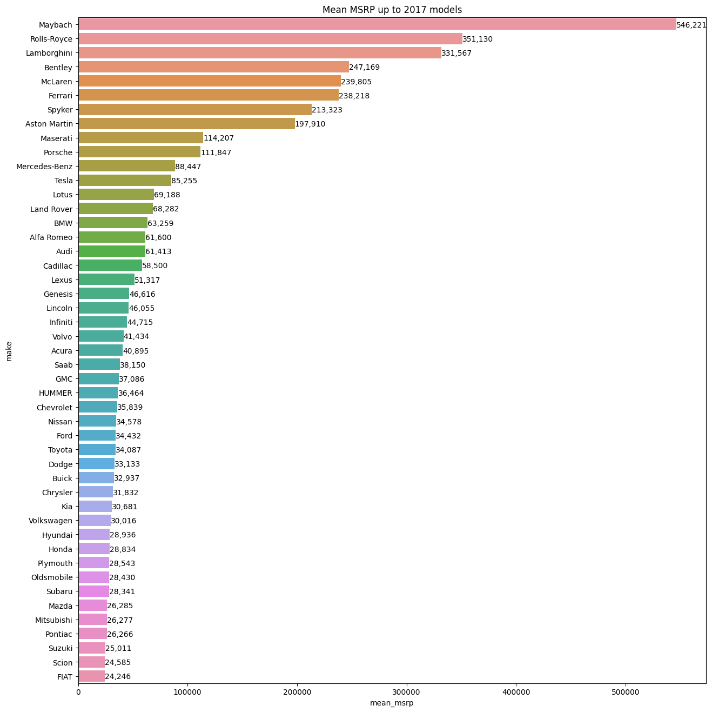

I have recently stumbled on video lectures for python's Jupyter library for
data visualization on [A Cloud Guru](https://acloud.guru/learn/introduction-to-jupyter-notebooks) and decided to give it a try.
I often wondered how the content in [r/dataisbeautiful](https://www.reddit.com/r/dataisbeautiful/) had been created, but also
wanted to create and post interesting and meaningful insights from data.

The course pointed me towards the pandas, matplotlib and seaborn library on
python. Creating beautiful graphs was surprisingly easy on python. The course
only scratched the surface when it came to the possibilities of those libraries,
but did mention kaggle as a resource.

[Kaggle](https://www.kaggle.com/) provides an interactive environment, more learning resources and user
submitted data sets sourced from different parts of the internet either provided
by open data or scraped from websites. I found the free interactive tutorials on
[kaggle](https://www.kaggle.com/learn/data-visualization) more useful than the one at A Cloud Guru.

I had recently been doing research on cars and wanted to learn
more about different car brands so I decided to try my hand with a data set on
cars. Being able to visualize and manipulate
data for specific or all car brands was very informative! Here is one of the
more interesting graphs that I created from this dataset. It excludes the most
expensive brand Bugatti as it was clearly an outlier with an average MSRP 3 times
higher than the 2nd most expensive brand (1.75M compared to 546K). The code
and a few other interesting graphs are in my [kaggle notebook](https://www.kaggle.com/sebastienluong/2017-car-msrp)

Being able to build graphs and insights from data was really cool and I'm
planning to continue tinkering with python and pandas. Maybe with some
visualization and interactivity with the bokeh library. My next project might
also involve some scrapped data if it's not currently available from kaggle.
I'll be posting interesting insights here or on kaggle.
